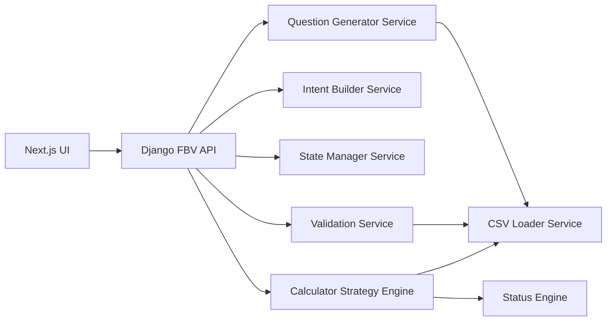

# Agentic KPI Builder

A complete interview-grade implementation of an agentic KPI system using:

- Frontend: Next.js Pages Router (JavaScript/JSX), Tailwind CSS, Axios
- Backend: Django + Django REST Framework (Function-Based Views only)
- Data layer: pandas over CSV (no ORM models for KPI logic)
- Architecture: Clean Architecture style, Service Layer pattern, separation of concerns

## Project Overview

This application allows a user to type a KPI name and then moves through an agent-like flow:

1. KPI Name Entry
2. Dynamic Question Generation
3. KPI Intent Creation
4. Intent Validation
5. KPI Calculation
6. Review Card
7. Approve / Edit / Regenerate

All KPI values are dynamically calculated from `backend/data/operations_events.csv`.

## Architecture Diagram



## Folder Structure

```text
kpi/
  operations_events.csv
  backend/
    manage.py
    requirements.txt
    data/
      operations_events.csv
    kpi_backend/
      settings.py
      urls.py
      asgi.py
      wsgi.py
    api/
      urls.py
      views.py
    services/
      csv_loader.py
      question_generator.py
      intent_builder.py
      state_manager.py
      validator.py
      calculator.py
      status_engine.py
  frontend/
    package.json
    tailwind.config.js
    postcss.config.js
    pages/
      _app.jsx
      index.jsx
      review.jsx
    components/
      KPIInput.jsx
      QuestionFlow.jsx
      ReviewCard.jsx
      StatusBadge.jsx
      LoadingSpinner.jsx
      ProgressStepper.jsx
      IntentPreview.jsx
    services/
      api.js
    styles/
      globals.css
```

## Agent Flow

- User enters KPI name on index screen.
- Backend infers metric type (`count`, `sum`, `average`, `ratio`) using keyword rules.
- Backend generates dynamic contextual questions using CSV unique values.
- User submits answers.
- Backend builds a structured KPI intent JSON.
- Backend validates intent against schema, allowed aggregations, allowed values, and ratio denominator safety.
- Backend computes KPI through strategy classes.
- Frontend shows review card with validation status + status badge.

## State Management

State is persisted on the frontend (localStorage) and echoed by backend responses:

```json
{
  "current_step": "questionnaire",
  "kpi_name": "Near Miss to Issue Ratio",
  "metric_type": "ratio",
  "interpretation": "I understand that you want to measure the ratio between Near Miss events and Issue events.",
  "answers": {},
  "intent": null,
  "validation_result": null,
  "calculation_result": null
}
```

State transition highlights:

- `kpi_name` -> `questionnaire` after `/generate-questions/`
- `questionnaire` -> `intent_validation` after `/build-intent/`
- `intent_validation` -> `calculation` after successful `/validate-intent/`
- `calculation` -> `review` after `/calculate-kpi/`
- Any stage -> `kpi_name` after `/reset-session/`

## Intent Flow

Example ratio intent:

```json
{
  "kpi_name": "Near Miss to Issue Ratio",
  "metric_type": "ratio",
  "aggregation": {
    "numerator": {
      "type": "count",
      "event_type": "Near Miss"
    },
    "denominator": {
      "type": "count",
      "event_type": "Issue"
    }
  },
  "filters": {
    "business_unit": "Manufacturing",
    "location": "Location A"
  },
  "time_period": {
    "type": "year",
    "value": "2026"
  }
}
```

## Validation Flow

Validation service checks:

- Column validation for filter keys and aggregation columns
- Value validation against CSV unique values
- Aggregation validation (`count`, `sum`, `average`, `ratio`)
- Ratio denominator safety to prevent divide-by-zero
- Time period type/value validity

Failure example:

```json
{
  "valid": false,
  "errors": [
    "Invalid value 'Problem' for event_type"
  ]
}
```

## Calculation Flow

The calculator uses strategy pattern classes:

- `CountStrategy`
- `SumStrategy`
- `AverageStrategy`
- `RatioStrategy`

Sample result object:

```json
{
  "kpi_name": "Near Miss to Issue Ratio",
  "value": 1.04,
  "formula": "COUNT(Near Miss) / COUNT(Issue)",
  "numerator": 103,
  "denominator": 99,
  "unit": "ratio",
  "status": "Good"
}
```

## API Contracts

### POST /api/generate-questions/
Request:

```json
{ "kpi_name": "Near Miss to Issue Ratio" }
```

Response includes `state`, `questions`, and `default_measure_column`.

### POST /api/build-intent/
Request:

```json
{
  "kpi_name": "Near Miss to Issue Ratio",
  "metric_type": "ratio",
  "answers": {
    "numerator_event_type": "Near Miss",
    "denominator_event_type": "Issue",
    "business_unit": "Manufacturing",
    "location": "All",
    "priority": "All",
    "impact_type": "All",
    "time_period_type": "year",
    "time_period_value": "2026"
  }
}
```

Response includes `intent` and updated `state`.

### POST /api/validate-intent/
Request:

```json
{ "intent": { "...": "..." } }
```

Response includes `validation_result` and updated `state`.

### POST /api/calculate-kpi/
Request:

```json
{ "intent": { "...": "..." } }
```

Response includes `calculation_result` and updated `state`.

### POST /api/reset-session/
Returns default state for a full frontend reset.

### GET /api/schema/
Returns endpoint map, current state, and CSV schema.

## Setup Instructions

## Backend

```bash
cd backend
python -m venv .venv
source .venv/bin/activate
pip install -r requirements.txt
python manage.py migrate
python manage.py runserver
```

Backend runs at `http://127.0.0.1:8000`.

## Frontend

```bash
cd frontend
npm install
npm run dev
```

Frontend runs at `http://localhost:3000`.

## Install and Run with Docker

Prerequisite:

- Docker and Docker Compose must be installed.

From the project root, run this one-time setup + start command:

```bash
docker compose up --build
```

For later runs (without rebuilding):

```bash
docker compose up
```

Run in detached mode:

```bash
docker compose up -d
```

Stop and remove containers:

```bash
docker compose down
```

App URLs:

- Frontend: `http://localhost:3000`
- Backend API: `http://localhost:8000/api`

## Assumptions

- CSV file exists at `backend/data/operations_events.csv`.
- KPI logic is rule-based and deterministic (no paid LLM APIs).
- Frontend localStorage state is the source of conversational continuity.
- Status thresholds are generic defaults and can be domain-tuned.

## Future Improvements

- Plug in LLM planner for richer intent extraction.
- Add persistent state store (Redis/Postgres).
- Add authentication + role-based KPI governance.
- Add unit/integration tests and CI pipeline.
- Add KPI template library and versioned intent schemas.

## Interview Talking Points

- Q1 depth: explicit state machine, transitions, and reusable services.
- Deterministic KPI parser: extracts metric type and ratio operands from KPI names without guessing.
- Rule-based fallback: no paid API dependency.
- Clean architecture: views are thin; business logic is in services.
- Extensibility: strategy pattern for new KPI types.
- Safe execution: validation before every calculation.

See `INTERVIEW_GUIDE.md` for a full narrative.
